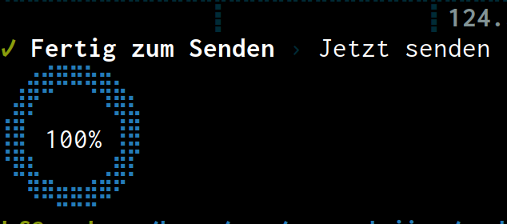

# JIRA 2 MOCO

Reads XLS files exported by JIRA Tempo and imports them to MOCO.

## Usage

1. ``yarn install`` to get all dependencies
2. copy ``config.sample.js`` to ``config.js`` and fill in your MOCO Api Key, your project and your task id. **ATTENTION** The format changed to JS Module.
3. Build with ``node build.mjs``
3. start with ``node dist/index.js [filename.xls]``